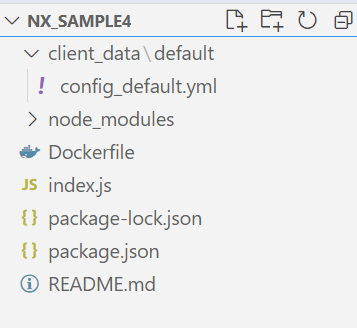
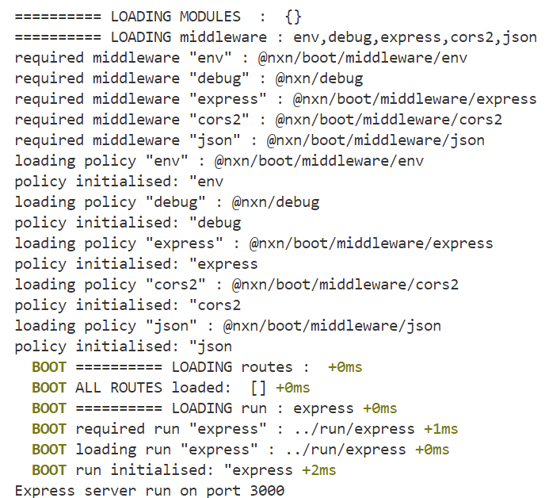

# Tutorial : using nxn-boot

## Overview ##
Framework for large scale applications, supporting configuration file, services, routes, express middleware, client data.

Small to very large applications, battle tested.

The main difference with other node.js frameworks are :

**Framework**
- pure javascript  based,
- all components are simple classes : no heavy library to learn. Only one class to derive from (optional)
- injections of components for modular architecture,
- each component benefits from its own configuration (parameters)
- all services, routes, models etc. are described in a YAML config (also generated with the CLI)

**Medium code**
- message/ node based architecure can be used for data processing chains (ex. indexing for AI, or other jobs)
- generation of 80% of the code : you just have to write code for your business logic

**Quality and documentation**
- jsdoc based with type checking enabled by default : benefit from types and ts typs without compiling
- documentation of the project generated in mermaid format.

## Base components for creating REST API ##
- **Routes** : for creating REST controllers,
- **Services** : for doing actual work ("providers"),

Routes and services are simple classes with optional "init()" functions.
These classes are listed in a YAML file and loaded by nxn at boot time.

*see sample below*...

## Install ##

Install @nxn/boot cli **nxg** from npm:

    npm install -g @nxn/cli

init the project:

    nxg init

and install dependencies:

    npm install

This creates following file structure:

    

        
    

    

        <ul>
            <li><strong>index.js</strong> : main file, that you never need to modify
            <li>a basic <strong>README.md</strong> for your documentation
            <li>client_data/default/<strong>config_default.yml</strong> : where all components are defined. 
            <li><strong>package.json</strong> with dependencies and scripts.
            <li><strong>Dockerfile</strong> that should work for most cases.
        </ul>
    

*Basically: index.js loads the application config_default.yml and initialises all components. Then it runs express (default server here).*

##Run the generated sample:##

Run the sample:

    node index.js

or 

    npm start

You should then see :

The application is then up and running.. It doesnt do much right now but everything is ready.
Have a look on the config file and you'll see sections where routes, services, run, tests anf middleware will be listed. 

### Docker ###
Just to make sure Dowker is also ready to go, create the image and run it:

    npm run docker
    npm run docker:run

You should then see the image running as well if Docker is installed on your workstation.

[NEXT >> Sample](./sample)