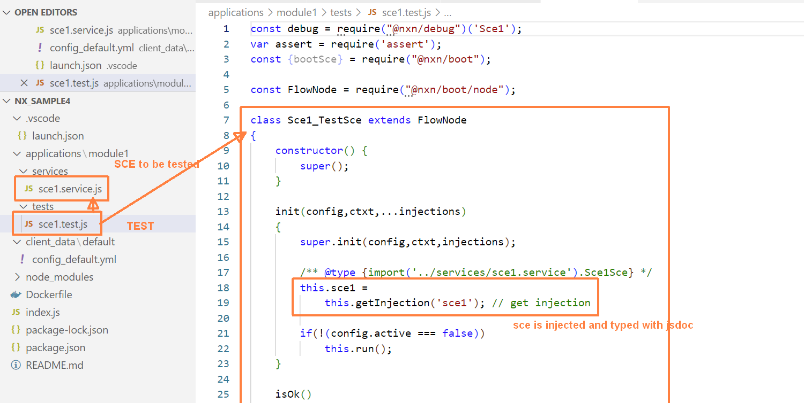
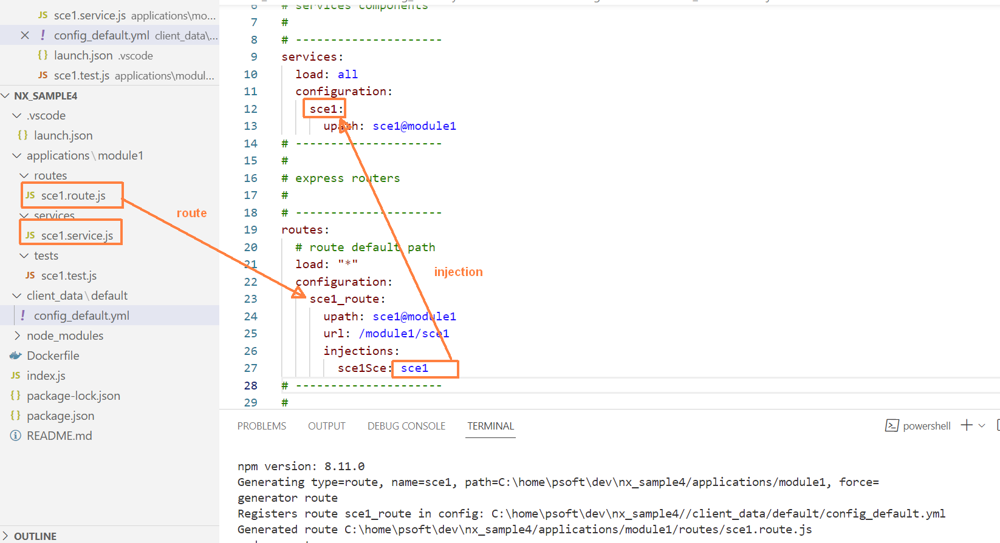

# SAMPLE CREATION OF A PROJECT


## create a service

create service "/applications/module1/services/sce1.service.js" in application module "module1"

```shell
    nxg service sce1@module1
```

generates a new file.


Please notice the syntax : **name**@**application** which is used by cli for creating services, routes, tests, etc. And also by the configuration for adding a class to be loaded, with shortcut "**upath**".

add it in configuration:

```yaml

services:
    configuration:
        ...
        sce1:
            upath: sce1@module1
```

```js

// @ts-check

// debug console, generates logs
const debug = require("@nxn/debug")('Sce1');

// FlowNode is a base class useful for injections, messages etc.
const FlowNode = require("@nxn/boot/node");

/** my service description here */
class Sce1Sce extends FlowNode
{
    constructor() {
        super();
    }

    /**
     * Init function that is called by nxn at load time if exists.
     * It provides the configuration parameters, and injections.
     * FlowNode:init initialises injections and registers this.config.
     * 
     * If a member variable is declared here, FlowNode will automatically populate it
     * with injection with same name. Alternativally, it can be set with this.getInjection().
     * 
     * @param {Record<string,any>} config parameters from the configuration file
     * @param {{express,app}} ctxt express context
     * @param  {...any} injections list of injections (other services etc.)
     */
    async init(config,ctxt,...injections) {
        super.init(config,ctxt,injections); 

        // your service initialisation code here
        debug.log("I am loaded!");

        // get other injection
        this.otherSce = this.getInjection('other_sce');
    }

    /**
     * true if the service is healthy. useful in tests or other services
     * to make sure it is ok. By default returns true if initialised.
     * 
     * @returns true if the service is healthy.
     */
    isOk() 
    {
        // return this.otherSce && this.otherSce.isOk();
        return super.isOk();
    }

    /**
     * your functions here...
     * @param {*} row 
     */
    test(row) {
        console.log("test ok");
    }
}

// service singleton
module.exports = new Sce1Sce();

// export types for jsdoc type checks
module.exports.Sce1Sce = Sce1Sce;

```
add some logging in the init function and run it:

    npm run start

## create a test for that same service

creates a class "/applications/module1/tests/sce1.test.js" in application module "module1"

```shell
    nxg test sce1@module1
```


creates it and adds it to the configuration:

```yaml

# ---------------------
# 
# Tests
# (launched if env TEST=true)
# 
# ---------------------
tests:
  load: all
  configuration:
    sce1_test:
      upath: sce1@module1
      injections:
        sce1: sce1

```

    Notice : the test service has an injection of the service that has been created above.



and includes a run() function that executes the tests on the service.

````js

   async run() 
    {
        try 
        {           
            // init tests data
            let sce = this.sce1;

            let token = this.config.token || process.env.TEST_TOKEN; // use token from config or env if provided

            /** @type {import('../types/types').gUser} */
            let user = {email:"me@mondomaine.com", gtoken:token};

            // search for groups starting with dev
            debug.log("test 0 : executing...");
            try 
            {
                assert.ok(sce,"sce injection not valid");
                assert.ok(sce.isOk(),"sce injection not valid");

                // add here your tests

                debug.log("test  ok");
            } 
            catch (error) 
            {
                throw error;               
            }

            debug.log("ALL TESTS COMPLETED WITH SUCCESS!!");                
        } 
        catch (error) 
        {
            debug.log("TEST FAILURE :  exception "+error.message||error);    
        }    
    }


````


## Testing the service 

Easiest way it to add a debug configuration in VSCode (launch.json)

````js

{
    // Use IntelliSense to learn about possible attributes.
    // Hover to view descriptions of existing attributes.
    // For more information, visit: https://go.microsoft.com/fwlink/?linkid=830387
    "version": "0.2.0",
    "configurations": [
        {
            "type": "node",
            "request": "launch",
            "name": "Launch Program",
            "skipFiles": [
                "<node_internals>/**"
            ],
            "program": "${workspaceFolder}\\index.js"
        },

        {
            "type": "node",
            "request": "launch",
            "name": "Test nxn sample",
            "program": "${workspaceFolder}/index.js",
            "args": [],
            "skipFiles": [
                "<node_internals>/**",
            ],
            "cwd": "${workspaceFolder}",
            "env": {
                "PORT" : "3000", 
                "TESTS" : "true", // activate tests suite?
            },
            "runtimeArgs": [
                "--preserve-symlinks"
              ]
              
        },        
    ]
}
````

Executed here:


NB. you can also execute tests by running the program with env TEST=true


## create a route for that same service

creates a class "/applications/module1/routes/sce1.route.js" in application module "module1"

```shell
    
    nxg route sce1@module1

```

add it in configuration:



    NB. in real cases, a route and other service are not called "sce1" but something more meaningfull like "tasks". It is important to name the route and sce1 with the same names because the cli then generates all the links and typing for you. Easier & faster.

## Complete and execute your API ##

Add these functions in the service:

````js
    async list(query=null) 
    {
        return [
            {id:1, name:"Dog"},
            {id:2, name:"Cat"},
        ]
    }

    async record(id) {
        return {id:2, name:"Cat"};
    }
````

and adapt the route accordingly:

````js

// endpoint w/ auth
        router.get('/', auth.authenticate(), async (req, res)=> {

            try 
            {
                let query = req.query;

                // call the injected service
                const list = await this.sce1Sce.list(query);

                res.send(list);    
            }
            catch(error) {
                let message = error.message || error;
                let code = parseInt(error.code||500, 10) || 500;
                res.status(code).send({code,error:message});
                debug.error(error.stack||error);
            }    
        });

        // endpoint w/ auth
        router.get('/:id', auth.authenticate(), async (req, res)=> {

            try {
                
                let id = req.params.id;

                // call the injected service
                const record = await this.sce1Sce.record(id);

                res.send(record);
            }
            catch(error) {
                let message = error.message || error;
                let code = parseInt(error.code||500, 10) || 500;
                res.status(code).send({code,error:message});
                debug.error(error.stack||error);
            }    
        }); 

````

***Running the server :***

npm run start:


You now see your route endpoints listed here : GET / and GET /:id

And **testing with Postman** or equivalent:


## Summary ##

you have created an API project with a server on express:
- with routes
- service
- running on node.js
- running on Docker

## Documentation of your project ##

The project is really simple for now, but you can have a documentation generated by nxn:

    nxg mermaid flows modules

produces the following:

````mermaid

graph LR;
subgraph main
    direction LR;

    subgraph Application
        direction LR;
        classDef nodeCls fill:#9C57BF,stroke:#eee,color:#fff
        classDef routeCls fill:#2080D0,stroke:#eee,color:#fff
        classDef nodCls fill:#9C57BF,stroke:#eee,color:#fff
        classDef serviceCls fill:#A9C9EB,stroke:#eee,color:#444
        classDef dataCls fill:#73BF67,stroke:#eee,color:#fff        
        classDef localeCls fill:#73BF67,stroke:#eee,color:#fff        
    sce1_route("sce1_route"):::routeCls
    sce1_route -- sce1Sce -->sce1;
    sce1["sce1"]:::serviceCls
end

    subgraph Legend
        Route:::routeCls
        Service:::serviceCls
        Node:::nodCls
        Data:::dataCls
        Locale:::localeCls
    end

end


style Application fill:#fff,stroke:#999,color:#222
style Legend fill:#eee,stroke:#eee,color:#333
style main fill:#eee,stroke:#eee,color:#eee

````

and 

````mermaid
graph TB;

subgraph Modules
    direction LR;
    classDef nodeCls fill:#9C57BF,stroke:#eee,color:#fff
    classDef routeCls fill:#2080D0,stroke:#eee,color:#fff
    classDef nodCls fill:#9C57BF,stroke:#eee,color:#fff
    classDef serviceCls fill:#A9C9EB,stroke:#eee,color:#444
    classDef dataCls fill:#73BF67,stroke:#eee,color:#fff
    classDef localeCls fill:#73BF67,stroke:#eee,color:#fff

subgraph module1
direction TB;

subgraph module1:routes["Routes"]
direction LR;

subgraph module1_routes1
direction TB;
    sce1_route_doc("<b>sce1_route</b><br><br><i>sce1@module1</i><br><br>"):::routeCls

end
style module1_routes1 fill:#fff,stroke:#fff,color:#fff

end
style module1:routes fill:#f0f0f0,stroke:#eee,color:#444


subgraph module1:services["Services"]
direction LR;

subgraph module1_services1
direction TB;
    sce1_doc["<b>sce1</b><br><br><i>sce1@module1</i><br><br>"]:::serviceCls

end
style module1_services1 fill:#fff,stroke:#fff,color:#fff

end
style module1:services fill:#f0f0f0,stroke:#eee,color:#444

end
style module1 fill:#f0f0f0,stroke:#eee,color:#444
end
style Modules fill:#fff,stroke:#999,color:#222


````


## 03/02/2024 added components in config

it is now possible to create a sub config file with services, routes etc.

can then be loaded in "components" section
ex.
```yaml

components:
  load: all

  configuration:
    # components : include services, routes, tests
    glabels: $ref(/applications/googleapi/config/glabel.component) # labels
    gbuckets: $ref(/applications/googleapi/config/gbuckets.component) # buckets

```

with : /applications/googleapi/config/glabel.component.yml 

```yaml

# google labels component : service and test suite

services:
  glabels:
    upath: glabels@googleapi
    labels:
      confidentiality:
        #match: "DLP"
        enums: 
          confidential: "(confidential|secret)"
          internal: "(intern[ae])"
          public: "Public"
tests:
  glabel_test:
    upath: glabels@googleapi
    token: ${{TEST_TOKEN||""}}
    injections:
      glabels: glabels
```
and:

/applications/googleapi/config/gbuckets.component.yml

```yaml
  
  # filestore buckets component : service and test suite

services:
  # filestore buckets service
  gbuckets:
    upath: gbuckets@googleapi
    conPath: .filestore
    bucket_name: "pdoc_file_revisions_${GED_CLIENT_ID}"
    secret_id: "gbuckets-${SECRET_SUFFIX_FIRESTORE}" # ex. gbuckets-env
    injections:
        secrets: googleSecretsYAML

tests:
  gbuckets_tests:
    upath: gbuckets@googleapi
    token: ${{TEST_TOKEN||""}}
    injections:
      gbuckets: gbuckets # use service account for storage
```

module configs are simply added to main config by sections.

## Test suite

Here is an example of a test.

A test is basically like a service. It gets ijected resources to test, and
runs at startup. It uses "assert" to check if everything runs as expected.

```js
var assert = require('assert');
const {bootSce} = require("@nxn/boot");

const FlowNode = require("@nxn/boot/node");
const debug = require("@nxn/debug")('TEST GGROUPS');

class Tests extends FlowNode
{
    constructor() {
        super();
    }

    init(config,ctxt,...injections)
    {
        super.init(config,ctxt,injections);

        /** @type {import('../services/gbuckets.service').GBucketInstance} */
        this.gbuckets = 
            this.getInjection('gbuckets'); // get injection
        
        if(!(config.active === false))
            this.run();
    }

    async run() 
    {
        try 
        {
            // await for services init to finish
            await new Promise(resolve => setTimeout(resolve, 5000));
            
            // init tests data
            let gbuckets = this.gbuckets;

            /** @type {import('../types/types').gUser} */
            let user = {email:"franck@presencemedia.ma", gToken:null};

            // search for groups starting with dev
            debug.log("test 0 : list files in buckets");   
            try 
            {
                assert.ok(gbuckets,"Bucket injection not valid");
                assert.ok(gbuckets,"Bucket name not set");
                debug.log("Bucket OK : name : "+gbuckets.bucketName);

                const files = await gbuckets.listFiles();
                console.log("Files",files);

                const filename = "TEST.txt";

                debug.log("Add file "+filename);
                let file = await gbuckets.writeFileData(filename,"simple test",{version:"1", revision:"1"});
                assert.ok(file,"file couldnt be added to bucket");

                const files2 = await gbuckets.listFiles();
                console.log("Files after adding "+filename,files2);

                assert.ok(await gbuckets.fileExists(filename),"Added file does not exist");

                await gbuckets.deleteFile(filename);

                assert.ok(!await gbuckets.fileExists(filename),"removed file still exists");

                debug.log("test  ok");
            } 
            catch (error) 
            {
                throw error;               
            }

            debug.log("ALL TESTS COMPLETED WITH SUCCESS!!");                
        } 
        catch (error) 
        {
            debug.log("TEST FAILURE :  exception "+error.message||error);
            throws error;  
        }    
    }
}

module.exports = new Tests()
```

## Managing injections

Injections are other services that have been initialised and can be used in a service, a route, a test, or a node.

Injections are declared in the configuration.

example:
```yml
    # database
    firestore:
      upath: firestore@googleapi
      conPath: .firestore
      # apply_client_id = coll_prefix | coll_suffix | none | db
      apply_client_id: coll_suffix

    # i8n locale
    gdrive_locale:
      path: "@nxn/db/locale.service"
      default: en
      langs:
        en: $ref(applications/drive_indexer/locales/en_gdrive.strings)

    # db model class : manage queries to the database. Abstracts the actual db and queries.
    gdrive_model:
      path: "@nxn/db/db_model.service"
      schema: $ref(applications/drive_indexer/models/gdrive.schema)
      injections:
        db: firestore
        locale: gdrive_locale

    # File service : manage gFile objects. It interacts with storage by using above db model
    gdrive_sce:
      upath: gdrive@drive_indexer
      injections:
        model: gdrive_model        
```

**gdrive_model** service uses **firestore** and **gdrive_locale** services as injections.

And **gdrive_sce** gets **gdrive_model** as injection.

### How are injections available in services

Injections and config parameters are provided to the objects declared with their init() function.

```js
/** my service description here */
class GFileSce extends FlowNode
{
    /**
     * DB model
     * @type {DbModel} */
    model;

    constructor(instName) {
        super(instName);
    }

    /** init the service with a config */
    async init(config,ctxt,...injections) {
        super.init(config,ctxt,injections); 

        /** get DB Model */
        this.model = this.getInjection('model');
    }
    ...
}

```
the **super.init()** function gets injections and organise them in the object.
The **GFileSce** service adds the **model** injection as a member variable, by using **getInjection()**.

```js
    /** get DB Model */
    this.model = this.getInjection('model');
```

NB. injections can be **AUTOMATICALLY added as member variables** if:
1) the local variable is **declared** in the class
2) the local variable has the **same name as the injection**
3) the variable is not yet defined (its **value must be undefined**)

The above example can then be rewritten without adding a getInjection() call in the init:

```js
/** my service description here */
class GFileSce extends FlowNode
{
    /**
     * DB model (automatically loaded from injection)
     * @type {DbModel} */
    model;

    constructor(instName) {
        super(instName);
    }

    /** init the service with a config */
    async init(config,ctxt,...injections) {
        super.init(config,ctxt,injections); 
    }
    ...
}

```
